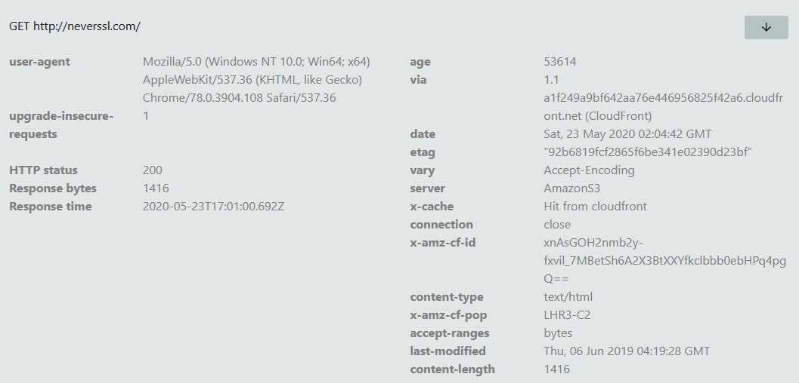
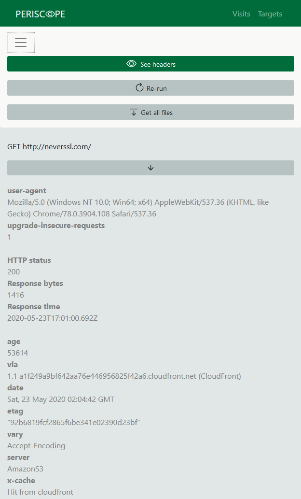
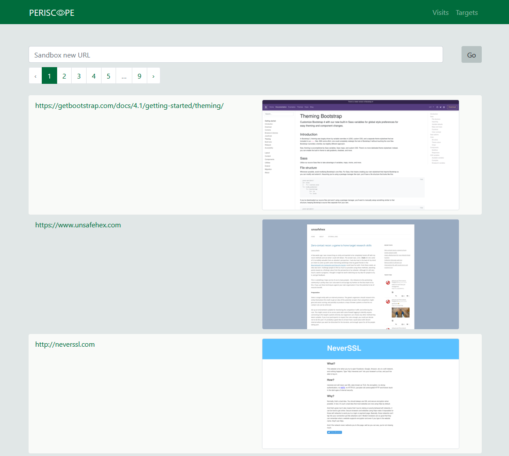

# Introduction

Periscope is a utility for gathering information on URLs without using your own browser. Using [puppeteer](https://github.com/puppeteer/puppeteer) it visits the site with Chromium headless and logs all of the resulting requests and responses. In addition, it uses [Don't FingerPrint Me](https://github.com/freethenation/DFPM) to identify potential browser fingerprinting.

# Periscope installation

Working with CentOS 8:
- Run `install.sh` as root
- Supply a database password and account name of the user __Periscope__ will be running as

# Sample output






# Periscope API reference

## Add a new target to be examined
`curl -XPOST http://periscope.local/targets/add -H "Content-Type: application/json" -d '{"url": "https://www.google.com"}'`

Adds a _target_ and associated _visit_ entry to the database
Returns the created _visit_ object

```
{
     visit: {
        visit_id: 2,
        target_id: 2,
        createtime: "2020-01-05T19:04:02.000Z",
        time_actioned: null,
        completed: false,
        screenshot_path: null
    }
}
```

## Get a list of targets
`curl http://periscope.local/targets`

Returns list of _target_ objects:

```
{
    data: [
        {
            target_id: 1, 
            createtime: "2020-01-03T21:10:08.000Z", 
            query: "https://www.google.com"
        }, 
        {target_id: 2, ...}
    ],
    pagination: {pagination}
}
```

## Get a list of visits to a specific target
`curl http://periscope.local/targets/1`

Returns list of _visit_ objects for the specified target ID:
```
{
    data: [
        {
            target_id: 1, 
            visit_id: 1,
            createtime: "2020-01-03T21:10:08.000Z", 
            query: "https://www.google.com",
            time_actioned: "2020-01-03T23:17:36.959Z",
            completed: true,
            screenshot_path: "/usr/local/unsafehex/periscope/api/public/images/20200103/1/screenshot.jpg"
        },
        {target_id: 1, visit_id: 2, ...}
    ],
    pagination: {pagination}
}
```

## Create a new visit instance for an existing target
`curl http://periscope.local/targets/1/new-visit`
 
 Creates a new _visit_ entry in the database for the specified target
 Returns the created _visit_ object

`curl http://periscope.local/visits`

Returns list of _visit_ objects:
```
{
    data: [
        {
            target_id: 1, 
            visit_id: 1,
            createtime: "2020-01-03T21:10:08.000Z", 
            query: "https://www.google.com",
            time_actioned: "2020-01-03T23:17:36.959Z",
            completed: true,
            screenshot_path: "/usr/local/unsafehex/periscope/api/public/images/20200103/1/screenshot.jpg"
        },
        {target_id: 1, visit_id: 2, ...}
    ],
    pagination: {pagination}
}
```

 ## Get the data for a specified visit ID

 `curl http://periscope.local/visits/1`

 Returns an object describing the visit, and the resulting requests and responses

 ```
 {
     visit: {
        target_id: 1, 
        visit_id: 1,
        createtime: "2020-01-03T21:10:08.000Z", 
        query: "https://www.google.com",
        time_actioned: "2020-01-03T23:17:36.959Z",
        completed: true,
        screenshot_path: "/usr/local/unsafehex/periscope/api/public/images/20200103/1/screenshot.jpg",
        settings: {
            /* object describing the parameters used in the visit; corresponds to a puppeteer device profile */
        }
    },
    results: {
        requests: {
            1: {
                request_time:  "2020-01-03T23:17:38.450Z",
                request_url: "https://www.google.com",
                request_post_data: "a=1&b=2",
                file_id: 0,
                response_time: "2020-01-03T23:17:38.547Z",
                response_size: 6924,
                request_headers: [
                    {
                        user-agent: "Mozilla/5.0"
                    },
                    {
                        Accept-Language: "en/us"
                    },
                    ...
                ]
                response_headers: [
                    {
                        server: "Apache"
                    },
                    {
                        set-cookie: "SERVERID97864=520214|Xg/Ll|Xg/Ll; path=/"
                    },
                    ...
                ]
            },
            2: {...}
        }
    },
    fingerprinting: {
        0: {
            dfpm_id: 3,
            visit_id: 1,
            method: 'apply',
            dfpm_path: 'self.CanvasRenderingContext2D.prototype.fillText',
            dfpm_level: 'warning',
            dfpm_category: 'canvas',
            dfpm_url: 'https://www.google.com'
        },
        1: {...}
    }
 }
 ```

## Get the content of a response

`wget http://periscope.local/visits/1/file/0`

Downloads the file content associated with a specified response within a specified visit

`wget --content-disposition http://periscope.local/visits/1/allfiles`

Downloads an archive of all response content

## Search requests and responses for a string of interest

`curl http://periscope.local/search?q=abc123`

Returns a JSON object with a list of requests and list of responses where a header value matched the query string

```
{
    requests: {
        data: [
            {
                header_id: 1401,
                request_id: 590,
                header_value: "abc123",
                visit_id: 4,
                request_time: "2020-01-03T23:17:38.450Z",
                request_post_data: null,
                request_url: "https://www.apple.com/",
                target_id: 3,
                createtime: "2020-01-03T21:10:08.000Z",
                time_actioned: "2020-01-03T23:17:36.959Z",
                completed: true,
                screenshot_path: null

            },
            {
                header_id: 1497,
                ...
            }
        ]
    },
    responsess: {
        data: [
            {
                header_id: 1784,
                response_id: 450,
                ...
            }
        ]
    }
}
```

## Get the screenshot for a specified visit

`curl http://periscope.local/visit/2/screenshot`

Returns 302 to `/images/$visit_date/$visit_id`

`curl http://periscope.local/images/20200105/2.png`

Returns the screenshot for the visit with ID 2